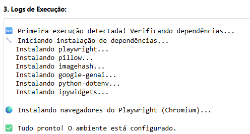
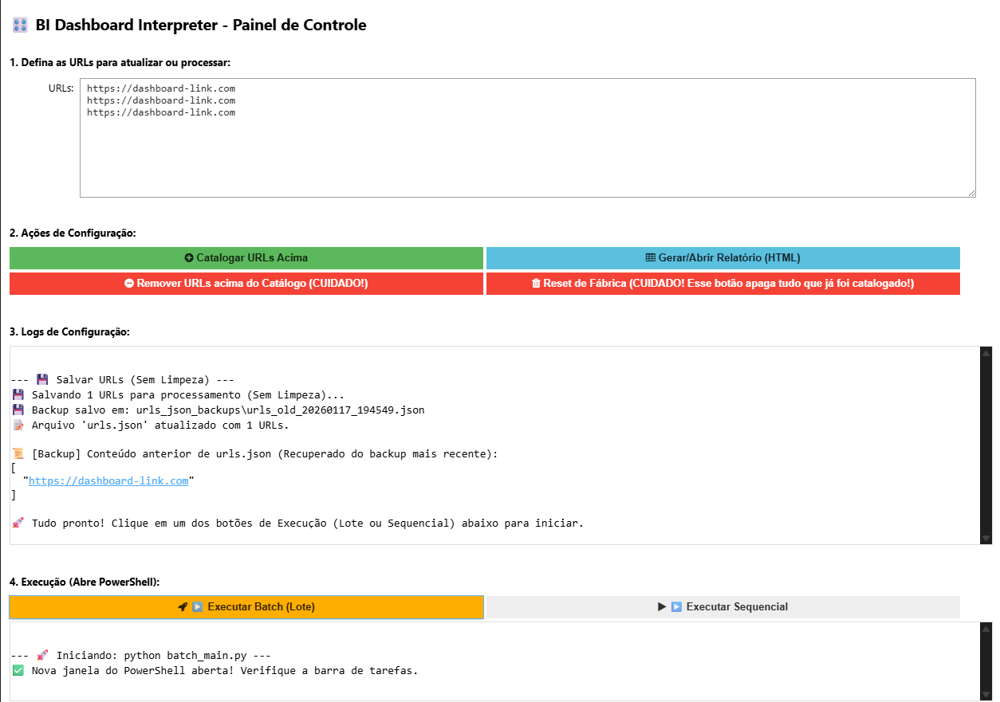
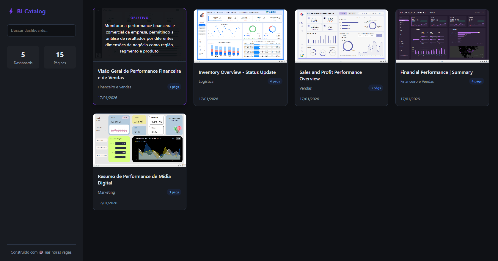
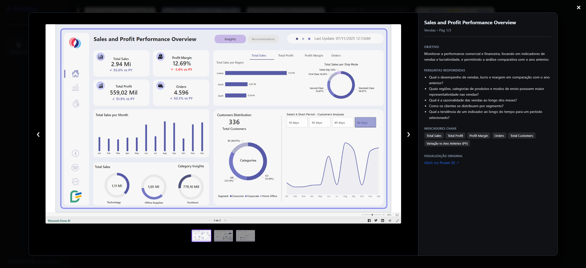
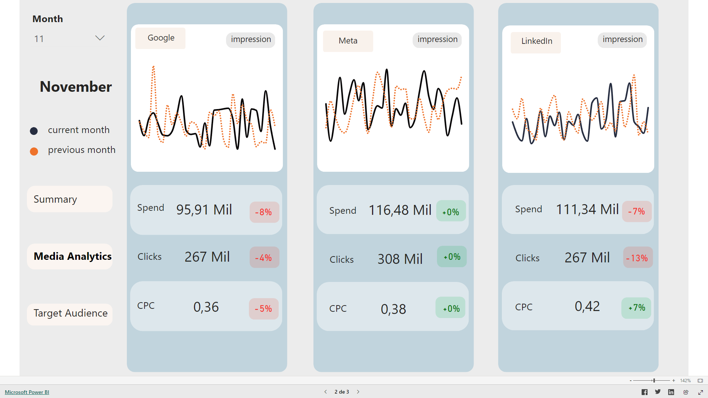
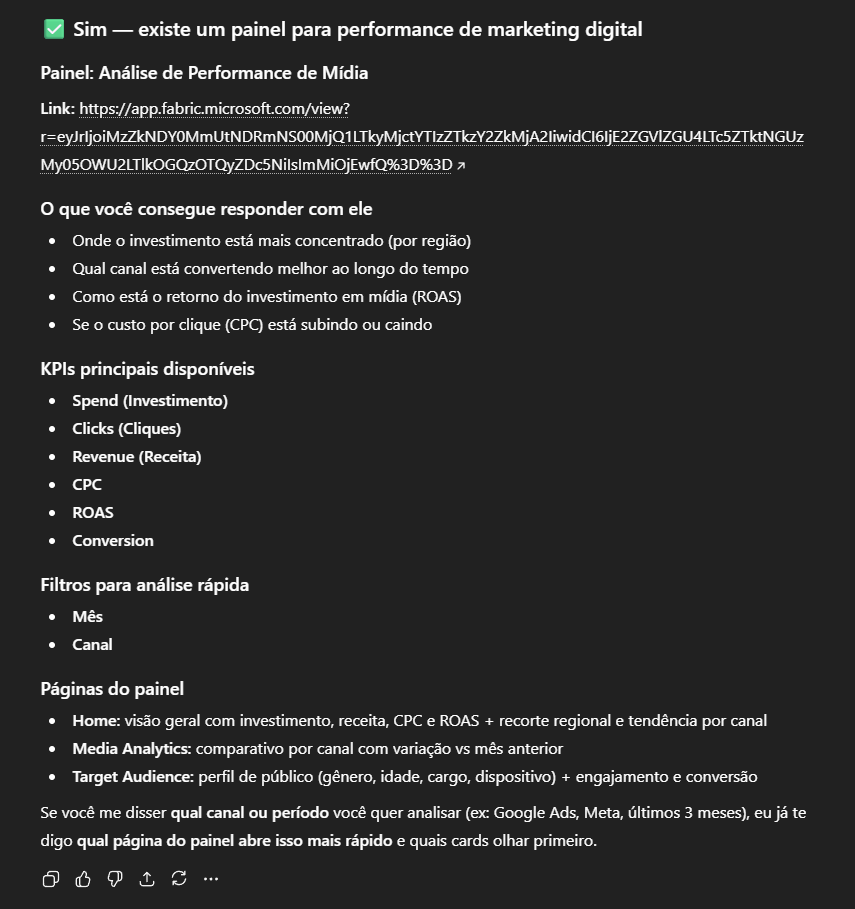

[](LICENSE)

# bi-dashboard-interpreter

*A visual-first cataloger for BI dashboards (UI automation + multimodal AI).*

<video src="hello-world/overview.mp4" width="100%" controls>
  Seu navegador não suporta o player de vídeo.
</video>

Este projeto utiliza IA Multimodal (Gemini 2.5 pro) e Automação de Navegador (Playwright) para navegar, capturar e documentar funcionalmente painéis de Business Intelligence (Power BI, etc.) automaticamente.

> Execute apenas com credenciais próprias e em conteúdos cuja captura/armazenamento (prints e metadados) seja permitido pelas políticas do ambiente.

## 📌 Nota de contexto

Este repositório nasceu como um estudo pessoal feito durante as férias, no meu tempo livre.
Não foi desenvolvido a pedido de terceiros, nem como parte de um projeto contratado.

> *Apesar de ser um projeto de *estudo*, ele resolve um problema real: a catalogação manual de painéis de BI é trabalhosa, desatualiza rapidamente e dificulta a descoberta de dados (data discovery). Este projeto automatiza esse processo.*


## Modularização

O código segue princípios de responsabilidade única:
* **`main.py`**: Orquestrador de entrada (Execução sequencial).
* **`batch_main.py`**: Orquestrador de alta performance (Execução paralela/assíncrona).
* **`cataloger.py`**: Orquestrador do fluxo (Coordena Batedor, Explorador e Analista).
* **`explorer.py`**: Motor de navegação e exploração de páginas (Gerencia cliques e deduplicação).
* **`click_strategy.py`**: Estratégias de clique com retries (Círculos Concêntricos, DOM Fallback).
* **`llm_service.py`**: Integração com Google GenAI (Gemini).
* **`bot_core.py`**: Camada de abstração do Playwright.
* **`reporter.py`**: Gerador de relatório estático (HTML interativo e visual).
* **`config.py`**: Centralização de constantes e ajustes finos.

## 🧪 Dashboards utilizados nos testes

* [Financial Performance Dashboard](https://community.fabric.microsoft.com/t5/Themes-Gallery/Financial-Performance-Dashboard/m-p/4901530), por Arbaz_Ahmad (Fabric Community Themes Gallery)
* [Marketing Campaign Analysis Dashboard](https://community.fabric.microsoft.com/t5/Themes-Gallery/Marketing-Campaign-Analysis-Dashboard/td-p/4887536), por visually (Fabric Community Themes Gallery)
* [The Sales & Profit Template](https://community.fabric.microsoft.com/t5/Themes-Gallery/The-Sales-amp-Profit-Template-that-shows-what-really-drives/td-p/4913311), por dataflip (Fabric Community Themes Gallery)
* [Sales Performance Dashboard](https://community.fabric.microsoft.com/t5/Themes-Gallery/Sales-performance-dashboard/td-p/4910244), por visually (Fabric Community Themes Gallery)
* [DataFlip Inventory Planning Dashboard](https://community.fabric.microsoft.com/t5/Themes-Gallery/DataFlip-Inventory-Planning-Dashboard/td-p/4889899), por dataflip (Fabric Community Themes Gallery)

**Observação:** os dashboards acima são de terceiros e estão publicados como showcase.

## 🚀 Como rodar

1. **Baixe o repositório e entre na pasta do projeto:**
```bash
git clone https://github.com/alexandrefortes/bi-dashboard-interpreter.git
cd bi-dashboard-interpreter/main
```

2. **Instale as dependências:**
```bash
python install_deps.py
```

> **✨ Ou, conte com a Instalação Automática** 
>
> Ao executar a primeira célula do notebook `bi-dashboard-interpreter.ipynb` pela primeira vez, o sistema detecta se as dependências já foram instaladas. Se não, ele instala tudo automaticamente (incluindo o Playwright) sem você precisar abrir o terminal.
>
> 

3. **Configure o ambiente:**
Crie um arquivo `.env` dentro da pasta `main` com sua chave:
```env
GEMINI_API_KEY="sua_chave_aqui"
```

4. **Execute:**
Gere o arquivo de URLs (via notebook `bi-dashboard-interpreter.ipynb` ou manualmente) e rode:
```bash
python main.py
```

## 🎛️ Guia Visual da Interface

O projeto conta com uma interface gráfica (GUI) rodando dentro do Jupyter Notebook para facilitar a configuração e operação diária.



### 1. Área de Input
Cole as URLs dos dashboards que deseja processar. Pode ser uma ou várias (uma por linha).
> **Dica:** O sistema salva automaticamente essa lista. Se você fechar e abrir de novo, suas URLs estarão lá.

### 2. Configuração (Botões Superiores)
*   **🟢 Catalogar URLs Acima:** Salva as URLs na fila de processamento. Use este botão no dia a dia para adicionar novos painéis sem apagar o que já foi feito.
*   **🔵 Gerar/Abrir Relatório:** Compila o site estático com o catálogo atual e abre no seu navegador. Funciona mesmo se o processamento ainda estiver ocorrendo (mostra o que já está pronto).
*   **🔴 Remover URLs (CUIDADO):** Remove o histórico (logs, prints, JSONs) **apenas das URLs listadas** na caixa de texto. Útil para reprocessar um painel específico do zero.
*   **🔴 Reset de Fábrica (PERIGO):** Botão "Pânico". Apaga **absolutamente tudo** (todas as execuções, relatórios e backups). Use apenas para começar um projeto novo.

### 3. Logs de Configuração
Caixa de texto onde você recebe feedback das ações acima (ex: "Backup salvo em...", "Memória limpa", etc.).

### 4. Execução (Botões Inferiores)
Ao clicar, o sistema abre uma janela externa do **PowerShell** para rodar o robô.

*   **🟧 Executar Batch (Lote):** O modo "Turbo". Processa múltiplos painéis ao mesmo tempo em abas diferentes. Recomendado para listas grandes. Tamanho do lote configurável em `config.py`.
*   **⬜ Executar Sequencial:** O modo "Clássico". Processa um por um. Útil para debug ou se você tem pouca memória RAM disponível.

---

## 🔐 Ambientes com login (MFA/SSO)

O robô foi desenhado para atuar em colaboração com o humano ("Human-in-the-loop") para operar em ambientes com SSO/MFA com participação do usuário autenticado.

1. Ao iniciar, o robô abre o navegador.
2. Se ele encontrar uma tela de login, o terminal exibirá: **`🛑 TELA DE LOGIN DETECTADA`**.
3. **Sua vez:** Vá até a janela do navegador aberta, digite seu e-mail, senha e aprove o MFA no celular.
4. Assim que o painel carregar, o robô detecta a mudança e retoma a automação sozinho.

> **Dica:** Se após o login a URL mudar para algo não esperado (ex: /home), copie a primeira URL do vetor (urls.json) e cole na barra de endereços do navegador do robô. Ele detectará o carregamento e continuará.

## 🧠 Arquitetura dos Agentes

O projeto opera com 3 "personas" de IA sequenciais:

### 1. The Scout (O Batedor)

* **Função:** Analisar a UI estática.
* **Lógica:** Envia o print da Home para o Gemini Vision. O modelo identifica padrões de navegação:
* *Nativa:* Rodapé do Power BI (ex.: "1 de 5").
* *Customizada:* Abas desenhadas no relatório (Abas superiores, Menu lateral).

* **Saída:** Lista de coordenadas normalizadas (x, y entre 0.0 e 1.0) de onde clicar.

### 2. The Explorer (O Explorador)

* **Função:** Navegar com resiliência.
* **Lógica Híbrida de Navegação:**
* **Navegação Nativa (Rodapé padrão):** Prioriza **clique direto no DOM** (via seletores CSS/HTML) pela precisão de 100%. Se falhar, recorre ao clique visual.
* **Navegação Customizada (Abas/Botões):** Usa **círculos concêntricos** baseados na visão (Scout). Tenta clicar na coordenada sugerida e, se falhar, expande círculos até validar a mudança de tela.

### 3. The Analyst (O Analista)

* **Função:** Documentação de Negócio.
* **Lógica:** Analisa apenas as páginas únicas validadas.
* **Saída:** Gera descrições funcionais (título, objetivo, filtros, público-alvo) ignorando dados voláteis (números do dia), focando na estrutura analítica (o que o painel diz).

### 4. The Reporter (O Repórter)

* **Função:** Consolidação e Apresentação.
* **Lógica:** Compila todo o conhecimento gerado em um site estático (HTML/CSS) leve e interativo, sem dependências de servidor.
* **Destaques:**
    * **Titulação Inteligente:** Refina títulos genéricos (ex: "Overview") para nomes descritivos baseados no conteúdo (ex: "Análise de Vendas"), com formatação profissional (Sentence case).
    * **Interatividade:** Busca dinâmica e cards com efeito *mouse-over* que revelam automaticamente o objetivo estratégico do painel, facilitando o *data discovery* rápido pelo usuário.

<br>

| **Visão Geral (Grid)** | **Detalhe (Drill-down)** |
|:---:|:---:|
|  |  |
<br>

### Adendo sobre captura de tela:

1. Acesso inicial ou clique para mudar de página
2. **Estabilização Visual:** Aguarda até que 2 screenshots consecutivas sejam idênticas (perceptual hash)
   - Garante que mapas, gráficos e visuais assíncronos terminem de renderizar
   - Timeout configurável (padrão: 30s navegação, 15s após clique, 5s scroll)
3. Chama `get_full_page_screenshot_bytes()` que:
    ├─ **Detecta scroll container:** Seleciona o elemento de maior área com scroll que ocupe ≥60% do viewport (ignora widgets internos menores)
    ├─ Volta ao topo (scrollTop = 0)
    ├─ Se tem scroll: captura múltiplas vezes com estabilização visual em cada posição
    ├─ Une as capturas
    └─ Volta ao topo novamente
4. Salva a imagem final

---

## 💾 Checkpoints e Resiliência

O sistema possui um mecanismo robusto para evitar perda de dados e reprocessamento desnecessário, ideal para rodar em lote.

### Como funciona
Ao processar uma URL, é criada uma pasta de trabalho temporária (`runs/wip_<hash>`). Se o script for interrompido, ao rodar novamente ele detecta essa pasta e retoma de onde parou:

1.  **Checkpoint do Scout (`scout_checkpoint.json`)**: Salvo após a identificação da navegação.
    *   *Retomada:* Se existir, o robô pula a chamada do LLM e a navegação inicial.
2.  **Checkpoint de Exploração (`exploration_checkpoint.json`)**: Salvo após clicar em todos os botões e coletar as imagens.
    *   *Retomada:* Se existir, o robô **nem abre o navegador**. Ele carrega as imagens do disco e vai direto para a fase de Análise.

### Finalização
Somente após o sucesso de todas as etapas a pasta é renomeada de `wip_<hash>` para o formato final `DATA_Titulo`.

---

## ⚡ Execução em Lote (Alta Performance)

Para processar múltiplas URLs simultaneamente e reduzir o tempo total, utilize o script `batch_main.py`.

### Diferenciais do Modo Batch
*   **Concorrência Controlada:** Processa múltiplos painéis por vez (configurável via `MAX_CONCURRENT_TASKS` em `config.py`).
*   **Navegador Compartilhado:** Abre apenas **uma instância** do Chromium e cria abas isoladas (contextos) para cada painel, economizando RAM por worker.
*   **Logs Contextuais:** O terminal exibe logs com identificadores únicos (ex: `[Worker-1]`, `[Worker-2]`) para facilitar o debug em paralelo.
*   **Segurança (Thread-safe):** Utiliza travas (`asyncio.Lock`) para garantir que o arquivo de histórico (`processed_urls.json`) não seja corrompido.

### Como executar
```bash
python batch_main.py
```

> **Nota:** Certifique-se de que o arquivo `urls.json` esteja populado corretamente. Basta rodar o notebook `bi-dashboard-interpreter.ipynb`.

---

## 📂 Estrutura de Saída

Cada execução cria uma pasta única dentro de `runs/` com o timestamp da execução e o título do painel:

```text
runs/
└── 20260113_213721_Titanic_Dataset/  # ID_Título (sanitizado)
    ├── catalog_Titanic_Dataset.json  # Metadados com título no nome
    └── screenshots/                  # Evidências visuais
        ├── 00_home.png               # Tela inicial
        ├── 01_target.png             # Página 2 (após clique)
        ├── 02_target.png             # Página 3 (após clique)
        └── ...

bi_catalog_report/            # Relatório Final (Site)
├── index.html                # Catálogo Interativo
└── images/                   # Imagens otimizadas para web


```

### Exemplo de Saída Real (The Analyst)

Abaixo, um exemplo real de como o agente interpreta uma tela.

**Entrada (Screenshot capturado automaticamente):**


*Origem: [Marketing Campaign Analysis Dashboard](https://community.fabric.microsoft.com/t5/Themes-Gallery/Marketing-Campaign-Analysis-Dashboard/td-p/4887536), por visually (Fabric Community Themes Gallery)*

**Saída (JSON gerado pelo Agente):**

```json
{
  "id": 1,
  "label": "Next Page (1/2)",
  "filename": "01_target.png",
  "analysis": {
    "titulo_painel": "Media Analytics",
    "objetivo_macro": "Monitorar e comparar a performance de campanhas de mídia paga entre diferentes plataformas digitais, analisando a evolução dos principais indicadores em relação ao período anterior.",
    "perguntas_respondidas": [
      "Qual plataforma de mídia digital apresenta o melhor Custo por Clique (CPC) no período selecionado?",
      "Como o investimento (Spend) e o volume de cliques se comparam entre Google, Meta e LinkedIn?",
      "Qual a tendência diária das impressões do mês atual em comparação com o mês anterior para cada plataforma?",
      "Qual foi a variação percentual dos indicadores de performance (Spend, Clicks, CPC) em relação ao mês anterior?"
    ],
    "dominio_negocio": "Marketing",
    "elementos_visuais": "Estrutura de cartões comparativos, um para cada plataforma de mídia. Cada cartão contém um gráfico de linhas para análise de tendência temporal (mês atual vs. anterior) e um conjunto de cartões de KPI para os principais indicadores de performance.",
    "filtros_visiveis": [
      "Mês"
    ],
    "principais_indicadores": [
      "Spend (Investimento)",
      "Clicks (Cliques)",
      "CPC (Custo por Clique)",
      "Impressions (Impressões)"
    ],
    "publico_sugerido": "Analista de Mercado"
  }
}
```

### Exemplos de saída do Scout (Navegação)

Quando o Scout analisa a imagem, ele retorna uma **reflexão (`nav_reflection`)** justificando a decisão, o que ajuda na auditabilidade do processo.

**Caso 1: Nenhuma navegação encontrada**

```json
{
    "nav_reflection": "Seguindo a ordem de prioridade, verifiquei a parte inferior da imagem em busca de um rodapé de navegação nativo do Power BI (barra cinza, contador de páginas, setas). Nenhum rodapé nativo foi encontrado. Em seguida, procurei por abas ou botões de navegação personalizados (no topo, lateral ou rodapé) que mudassem a página inteira. Encontrei vários botões que funcionam como filtros/slicers para os dados da página atual (ex: 'Age Ranges', 'Contains family', 'Sex'), mas nenhum que sirva para navegar entre diferentes páginas do relatório. Como nenhum dos métodos de navegação primários foi identificado, o tipo é 'none'.",
    "nav_type": "none",
    "page_count_visual": null,
    "targets": []
}
```

**Caso 2: Navegação Nativa Detectada**

```json
{
    "nav_reflection": "A análise seguiu a ordem de prioridade definida. Primeiramente, verifiquei a parte inferior da captura de tela e identifiquei um rodapé nativo do Power BI. Este rodapé contém a contagem de páginas ('1 de 3') e as setas de navegação ('<' e '>'). Como a presença do rodapé nativo tem a maior prioridade, ele foi selecionado como o método de navegação principal. A lista de botões personalizados na lateral esquerda ('Summary', 'Media Analytics', etc.) foi ignorada, conforme as regras. O alvo foi definido como a seta de 'Próxima Página' ('>') dentro deste rodapé.",
    "nav_type": "native_footer",
    "page_count_visual": "1 de 3",
    "targets": [
        {
            "label": "Next Page Button",
            "x": 0.526,
            "y": 0.984
        }
    ]
}
```

---

## 💡 Potencial de Uso (Casos de Uso)

Os dados estruturados gerados por este interpretador habilitam aplicações como:

### 1. Catálogo de Dados Inteligente
Alimente ferramentas de governança (como DataHub, Amundsen ou Notion) com metadados ricos e **prints atualizados** automaticamente, eliminando a documentação manual desatualizada.

### 2. Chatbot de Data Discovery (RAG)
Crie um assistente que ajuda usuários a encontrar o painel certo via chat natural:
*   **Input:** *"Onde vejo a performance de vendas por região?"*
*   **Matching:** Um modelo LLM compara a pergunta do usuário com o campo `perguntas_respondidas` do JSON gerado.
*   **Resposta:** *"Recomendo o painel **Sales Overview**. Ele responde 'Qual a performance regional?'. Veja uma prévia:"*
*   **Visual:** Exibe (se permitido) a imagem `00_home.png` para o usuário confirmar antes de clicar no link.

**Exemplo de Resposta (gerada a partir dos metadados catalogados):**

> **Pergunta do Usuário:** *"Estou precisando de dados sobre performance de marketing digital. Existe algum painel sobre isso?"*



### 3. Detecção de Painéis Redundantes
Identifique dashboards duplicados ou sobrepostos automaticamente:
*   **Como funciona:** Um LLM compara semanticamente os metadados gerados (`objetivo_macro`, `perguntas_respondidas`, `principais_indicadores`, `dominio_negocio`) entre todos os painéis catalogados.
*   **Resultado:** Lista de pares de painéis com alta similaridade semântica, mesmo que tenham nomes diferentes.
*   **Valor:** Reduz custo de manutenção, elimina confusão do usuário final e melhora a governança do ambiente analítico.

---

## ⚙️ Configuração Avançada (`config.py`)

Você pode ajustar a sensibilidade do robô:

* **`CLICK_ATTEMPT_OFFSETS`**: Lista de offsets gerada dinamicamente em círculos concêntricos.
  * Por padrão: centro + 4 anéis × 8 direções = **33 pontos de tentativa**.
  * Configurável via `_generate_concentric_offsets(max_radius, step)` em `config.py`.

* **`MAX_CONCURRENT_TASKS`**: Define quantos painéis serão processados simultaneamente no `batch_main.py` (padrão: 2). Ajuste conforme a RAM disponível.
* **`ROI_CROP`**: Define áreas da tela para ignorar no cálculo de duplicidade (ex: ignorar rodapé, focando só nos gráficos).
* **`LLM_MAX_RETRIES`**: Número máximo de tentativas em caso de falha na API do Gemini (padrão: 3).
* **`LLM_BASE_DELAY`**: Delay base em segundos para backoff exponencial (padrão: 1s → delays de 1s, 2s, 4s).
  * Recupera automaticamente de erros transientes: rate limit, timeout, erro 500.
  * Tempo máximo de espera: ~7s antes de desistir.

## 🛠️ Solução de Problemas

**O robô clica, mas a página não muda?**  
O sistema usa círculos concêntricos para encontrar o alvo. Se ainda falhar, se a estabilização visual está detectando mudanças. Adicione mais offsets no `CLICK_ATTEMPT_OFFSETS` em `config.py` se necessário.

**Visuais carregando pela metade (mapas, gráficos)?**  
A estabilização visual deveria resolver isso automaticamente. Se persistir, aumente o `max_wait_seconds` em `_wait_for_visual_stability()` no `bot_core.py`.

**Scroll capturando widget interno (tabela) em vez da página?**  
O sistema seleciona o elemento de maior área com scroll que ocupe ≥60% do viewport. Se ainda selecionar errado, ajuste `min_area_ratio` em `_find_scroll_container()` no `bot_core.py`.

**Erros de "White Screen"?**  
O sistema possui detecção automática de tela branca (erros de renderização). Se a imagem for >99% branca, ela é ignorada e logada como erro, sem quebrar o fluxo. Isso evita falsos positivos em dashboards minimalistas legítimos.

## Recomendações para Uso em Produção 

Este repositório **salva screenshots e metadados por execução**. Em ambientes reais isso pode capturar informação sensível (PII, dados financeiros, segredos comerciais).

**Importante:** os controles abaixo são **recomendações de governança** para uso produtivo. **Eles não estão implementados neste estudo** por padrão.

### 1) Classificação de sensibilidade (recomendado)
Antes de executar, defina a classificação da evidência gerada por URL:

- `public`: dashboards públicos ou showcase
- `internal`: dados internos não sensíveis
- `restricted`: pode conter PII/financeiro/sigilo
- `secret`: dados críticos (recomendação: **proibir captura**)

### 2) Retenção e expurgo (recomendado)
Para reduzir risco e superfície de exposição defina uma política de retenção por classificação e automatize expurgo:

- Por exemplo:
  - `public/internal`: 30 dias
  - `restricted`: 7 dias
  - `secret`: **0 dias** (não capturar)

### 3) Acesso e armazenamento (recomendado)
Não trate `runs/` como repositório permanente.

- Armazenar evidências em local com **controle de acesso** e **trilha de auditoria**
- Evitar armazenamento em máquinas pessoais
- Se persistir em storage, preferir solução corporativa com logs de acesso

Objetivo: impedir compartilhamento acidental e falta de rastreabilidade.

### 4) Outros possíveis controles técnicos (não implementados aqui)
Em cenários produtivos, é comum exigir mecanismos de enforcement no runtime:

- **Allowlist de domínios/URLs**: bloquear execução fora de destinos aprovados
- **Modo "metadata-only"**: gerar catálogo sem salvar imagens
- **Redação/máscara de áreas**: esconder regiões com PII (tabelas, emails, IDs)
- **Bloqueio por classificação**: impedir captura quando a política proíbe (ex.: `secret`)

---

## 📊 KPIs Sugeridos

1) **Cobertura de Catálogo**
   - Definição: % de dashboards com catálogo válido gerado
   - Fórmula: `dashboards_catalogados / dashboards_alvo`
   - Objetivo: aumentar cobertura sem aumentar esforço manual

2) **Tempo de Catalogação (por dashboard)**
   - Definição: tempo total por URL (fim a fim)
   - Fórmula: `t_fim - t_inicio`
   - Uso: comparar modo sequencial vs batch, e medir ganho de automação

3) **Custo Evitado de Documentação Manual**
   - Definição: horas economizadas em relação ao processo manual
   - Fórmula: `(tempo_manual_medio - tempo_automatico_medio) * volume`
   - Conversão financeira: `horas_economizadas * custo_hora`
   - Observação: não exige "revenue"; é custo direto evitado

4) **Taxa de Reprocessamento / Falhas**
   - Definição: % de URLs que exigem reprocessamento por erro (white screen, login, navegação quebrada)
   - Fórmula: `reprocessamentos / execuções`
   - Objetivo: reduzir instabilidade e custo operacional

### Valor de Negócio
- Reduz tempo para encontrar o painel certo (data discovery)
- Reduz retrabalho de documentação e evidência
- Reduz risco de governança (catálogo desatualizado)

---

## 💰 Custo e Performance (estimativa)

Estimativas baseadas em testes reais com o modelo **Gemini 2.5 Pro** e execução em lote (2 workers).

### Painel Médio - 5 Abas
*   **Consumo de Tokens:** ~6.400 tokens (4.200 entrada + 2.200 saída)
*   **Tempo de Processamento:** ~2min 15s
*   **Custo (USD):** $0,027
*   **Custo (BRL):** R$ 0,16 (dólar a R$ 6,00)

### Projeto Grande (Ex.: cenário com 300 Painéis)
*   **Custo Total de API:** ~R$ 48,00
*   **Tempo Total (Batch):** ~6 horas (com 2 workers simultâneos)

### 🆚 Comparativo: Manual vs Automação

*Cenário Manual:* Considera um Analista Sênior realizando estritamente o trabalho operacional (Navegar > Print > Colar no Chatbot IA > Salvar JSON). Organizando todos os assets finais.
*   **Tempo Manual Estimado:** 15 min/painel (5 abas) x 300 = **75 horas**
*   **Custo de Oportunidade:** 75h x R$ 100/h = **R$ 7.500,00**

| Indicador | Humano (Operacional) | Robô (Bi-Interpreter) | Diferença |
| :--- | :--- | :--- | :--- |
| **Custo Total** | R$ 7.500,00 | **R$ 48,00** | **-99,3%** |
| **Tempo Total** | ~2 semanas (full-time) | **~6 horas** | **80x mais rápido** |
| **Fadiga** | Alta (erro humano) | Zero oss | **Consistência** |
| **Escalabilidade** | Linear (mais gente = mais $) | Exponencial | **Custo marginal** |

> **Nota sobre Qualidade e "Slop Work":**
> *   **Risco Humano:** Fadiga, erros de copy-paste e perda de padrão após horas de trabalho repetitivo ("piloto automático").
> *   **Risco IA:** Alucinação (inventar fatos), mitigado aqui por prompts estritos.
> *   **Veredito:** É muito mais eficiente e seguro **revisar** 300 painéis pré-gerados por IA do que **catalogar** 300 do zero.

---

## 👤 Sobre o Autor

**Alexandre Fortes**  
*Data & AI Executive @ Efí Bank*

Executivo de Dados e IA com atuação "hands-on". Especialista em colocar sistemas de LLM em produção (end-to-end), desde o desenho do problema até a entrega segura em operações críticas. 

[](https://www.linkedin.com/in/alexandre-f-santana/)
[](https://github.com/alexandrefortes)

---

## 📝 Licença


Este projeto é licenciado sob a **Apache License 2.0**.  
Consulte o arquivo [LICENSE](LICENSE) para mais detalhes.

A licença garante:
* ✅ Uso comercial livre.
* ✅ Modificação e distribuição permitidas.
* 🛡️ Proteção contra processos de patentes.